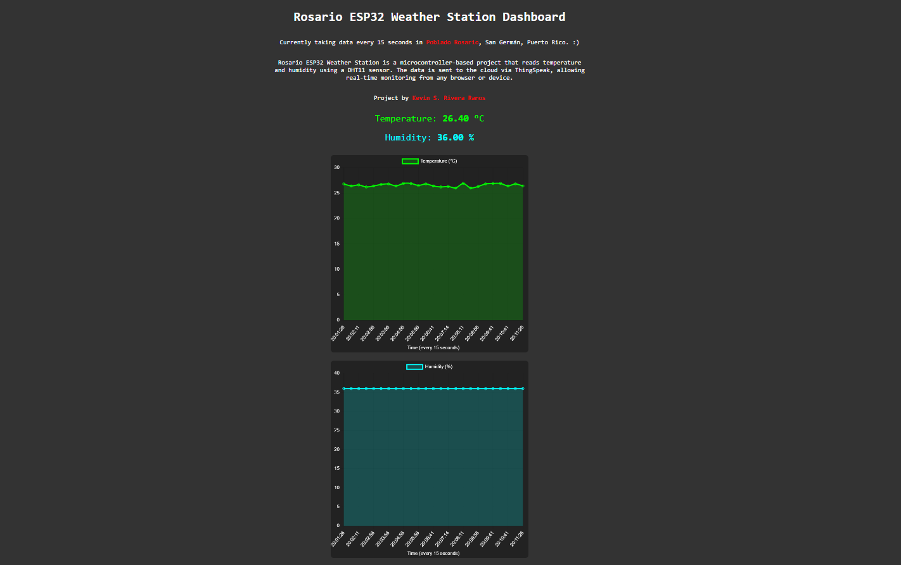
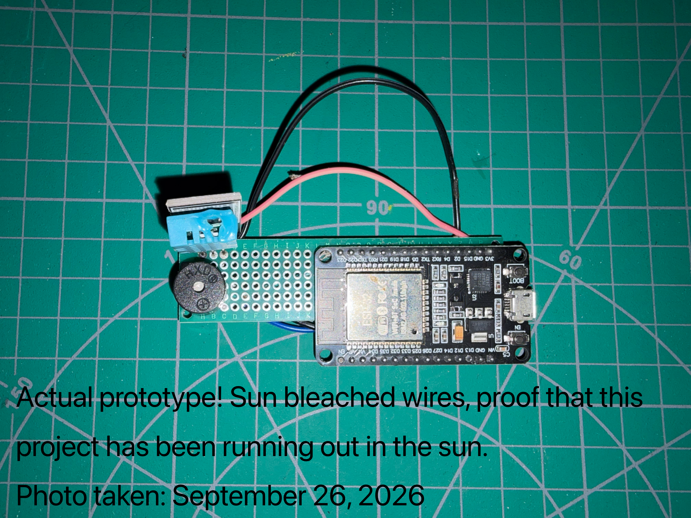
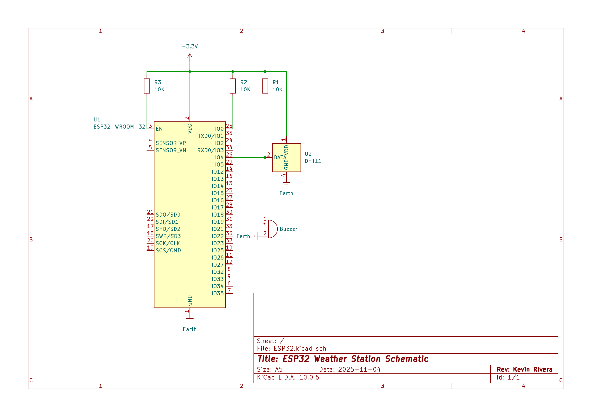
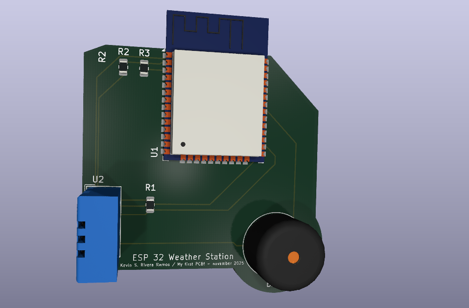

# ESP32  Weather Station

> **A very special project for me!** This was my very first project, built with a lot of patience and excitement as I took my first steps into the world of electronics (It has a lot of errors but its part of the proccess). It was where I began learning how to solder, read and create schematics, connect hardware, and bring together electronics, software, and the web into a working system. **November 2025**

An IoT project powered by an **ESP32** microcontroller and a **DHT11** temperature and humidity sensor. It reads environmental data in real-time and sends it to the **ThingSpeak** cloud platform via HTTP GET requests. Additionally, it features a custom web dashboard to display the data.

---

## Bill of Materials (BOM)

* **ESP32-WROOM-32** Development Board
* **DHT11** Temperature & Humidity Sensor

---

## Web


> *Live data visualization dashboard! Shows how the hardware seamlessly updates environmental metrics over WiFi and ThingSpeak every 15 seconds. *

## Hardware
 
> *The actual prototype! Sun-bleached wires proof that this project has been running and testing out in the real world.* **Photo taken: September 26, 2026**


> *The KiCad circuit schematic! Showing the ESP32-WROOM-32 wired up with the DHT11 sensor, pull-up resistors, and buzzer.*


> *3D PCB render exported directly from KiCad! Demonstrating the compact board design and trace routing for the final hardware layout (and its errors).*

---

## Project Structure

```text
.
├── firmware/         # ESP32 C++ source code (Arduino IDE)
├── web/              # Custom web dashboard interface
├── hardware/         # photos, schematics, and PCB files
└── extra/            # extra photos
